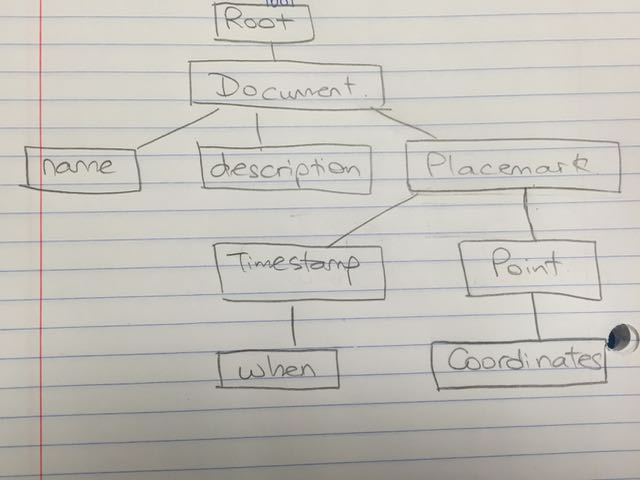

<!-- Don't edit in between this line and the one below -->
```{r include=FALSE}
# Don't delete this chunk if you are using the DataComputing package
library(DataComputing)
library(XML)
```
*Source file* 
```{r, results='asis', echo=FALSE}
includeSourceDocuments()
```
<!-- Don't edit the material above this line -->

## Question 1



## Question 2
```{r}
NCEDCdata = read.csv("NCEDC3%2Bquakes.csv")

New_NCEDC_df <- NCEDCdata %>% 
  filter(Magnitude >= 4)
longitude <- as.vector(New_NCEDC_df$Longitude)
latitude <- as.vector(New_NCEDC_df$Latitude)
```

## Question 3, 4, 5, 6
```{r}
doc <- newXMLDoc()
root1 <- newXMLNode("kml",namespaceDefinitions = "http://www.opengis.net/kml/2.2", doc = doc)
docmt <- newXMLNode("Document", parent = root1)
name <- newXMLNode("name", "Earthquakes", parent = docmt)  
descrpt <- newXMLNode("description", "4+ Earthquakes, 1966-present", parent = docmt)
placemark <- newXMLNode("Placemark", parent = docmt)
point <- newXMLNode("Point", parent = placemark)
coordinate <- newXMLNode("coordinates", "-124.9497,41.0352,0 ", parent = point)
saveXML(doc, file = "/Users/yishanhan/Desktop/homework10_6.kml")
```

## Question 7 and 8
```{r}
datetime <- as.character(New_NCEDC_df$DateTime) 
datetimefix <- gsub("/", "-", datetime)
datetimefix <- gsub(" ", "T", datetimefix) 

doc <- newXMLDoc()
root1 <- newXMLNode("kml",namespaceDefinitions = "http://www.opengis.net/kml/2.2", doc = doc)
docmt <- newXMLNode("Document", parent = root1)
name <- newXMLNode("name", "Earthquakes", parent = docmt)  
descrpt <- newXMLNode("description", "4+ Earthquakes, 1966-present", parent = docmt)

for (i in 1:length(longitude)) {
  coordinate1 <- paste(longitude[i],",",latitude[i],",0 ")
  y <- newXMLNode("Placemark", parent = docmt) 
  x <- newXMLNode("Point", parent = y)
  newXMLNode("coordinates", coordinate1, parent = x)
  z <- newXMLNode("TimeStamp", parent = y)
  newXMLNode("when", datetimefix[i], parent = z)
}  
saveXML(doc, file = "/Users/yishanhan/Desktop/homework10.kml")
```


